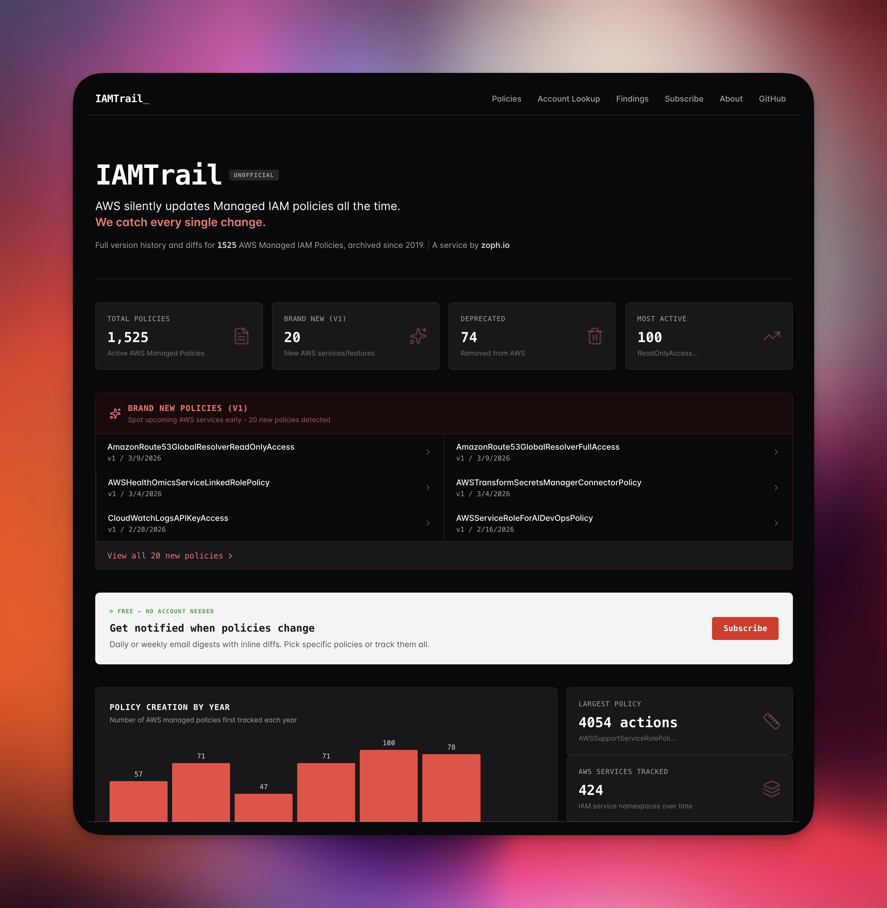

# IAMTrail

### AWS Managed Policy Changes Archive

_Previously known as MAMIP (Monitor AWS Managed IAM Policies)._

Track every change to AWS Managed IAM Policies with full version history and validation.

**[Website](https://iamtrail.com)** | **[Browse Policies](https://iamtrail.com/policies)** | **[About](https://iamtrail.com/about)**

---

## Website

Explore AWS Managed IAM Policies through a searchable web interface at **[iamtrail.com](https://iamtrail.com)**:

- Search and filter across 1,465+ managed policies
- Full version history with git diffs for every policy
- Syntax-highlighted JSON policy viewer
- New (v1) policy tracking to spot new AWS services
- Policy validation findings from AWS Access Analyzer
- [Known AWS Account lookup](https://iamtrail.com/accounts) - identify who owns an AWS account ID, powered by the [fwdcloudsec/known_aws_accounts](https://github.com/fwdcloudsec/known_aws_accounts) community dataset

---

## Get Notified

Subscribe to policy changes:

- **Email Digest** (recommended): [Subscribe on iamtrail.com](https://iamtrail.com/subscribe) - daily or weekly emails with inline diffs, per-policy filtering, no account required
- **Bluesky**: [@iamtrail.bsky.social](https://bsky.app/profile/iamtrail.bsky.social)
- **X/Twitter**: [@iamtrail_](https://x.com/iamtrail_)
- **RSS Feeds** ([all feeds](https://iamtrail.com/feeds/)):
  - [All Changes](https://iamtrail.com/feeds/all.xml) - everything in one feed
  - [IAM Policy Changes](https://iamtrail.com/feeds/iam-policies.xml) - policy updates, new policies, deprecations
  - [Endpoint Changes](https://iamtrail.com/feeds/endpoints.xml) - new regions, services, and expansions from botocore
  - [GuardDuty Announcements](https://iamtrail.com/feeds/guardduty.xml) - new findings, features, and region launches

## Browse the Data

All policies are stored as JSON in this repository and updated automatically every 4 hours on weekdays.

| Path | Description |
| --- | --- |
| [`policies/`](./policies/) | 1,465+ current AWS Managed IAM Policies |
| [`findings/`](./findings/) | Access Analyzer validation results |
| [`DEPRECATED.json`](./DEPRECATED.json) | Historical record of 73+ deprecated policies |

## How It Works

An automated workflow runs every 4 hours (Mon-Fri):

1. Fetch all AWS Managed IAM Policies via the AWS API
2. Detect new, updated, or deprecated policies
3. Validate each policy with AWS Access Analyzer
4. Commit changes to git (one commit per policy)
5. Notify via social channels and email digests

## Credits

Inspired by [Scott Piper's](https://twitter.com/0xdabbad00) original [aws_managed_policies](https://github.com/SummitRoute/aws_managed_policies) repository. Thank you, Scott, for pioneering this.

## License

GNU General Public License v3.0 - see [LICENSE](LICENSE) for details.

---

**[Website](https://iamtrail.com)** | **[RSS Feeds](https://iamtrail.com/feeds/)** | **[Bluesky](https://bsky.app/profile/iamtrail.bsky.social)** | **[X/Twitter](https://x.com/iamtrail_)**

Made by [zoph.io](https://zoph.io) - AWS Cloud Advisory Boutique

_Unofficial archive, not affiliated with AWS._

